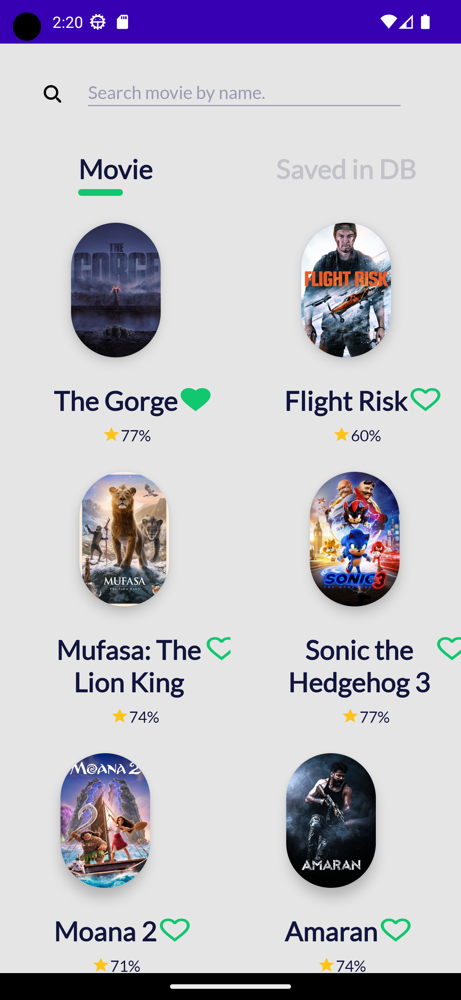
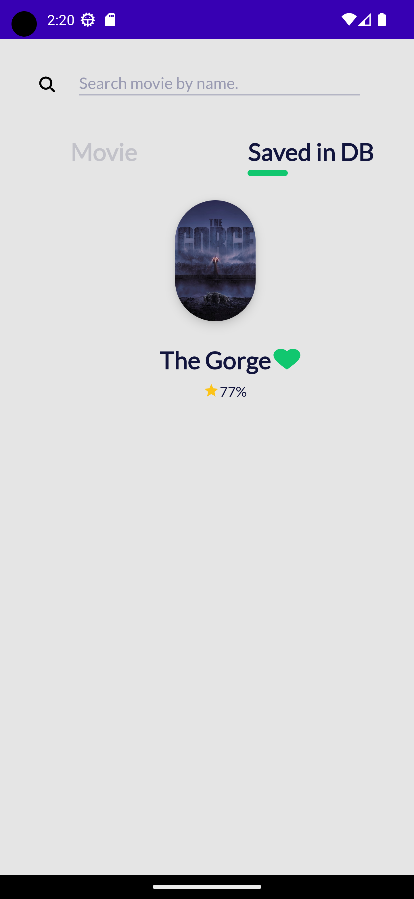
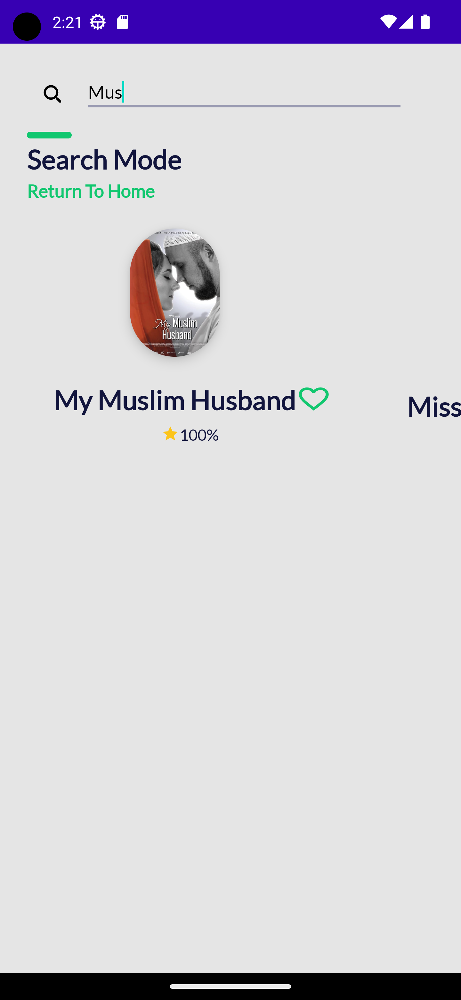

<h1 align= "center">Movies App: TMDB APP</h1>

### 🎬 About Android Application project
This is an Android application written in Kotlin that provides users with a list of movies using The Movie Database API database. On the app, users can favorite movies (saving them locally), filter movies , search for movies and see the details of any selected movie.

## 📱 Images
<h1 align="center">
 

 
 
 
 

</h1>

## 👩‍💻 Technologies and tools used:
- Retrofit
- Room Database
- Constraint Layout
- JUnit (unit tests)
- MVVM & Clean Architecture
